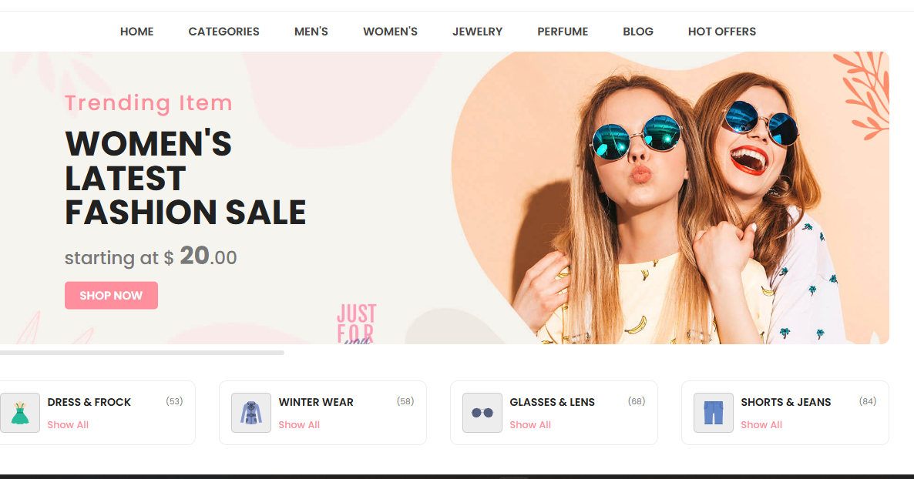
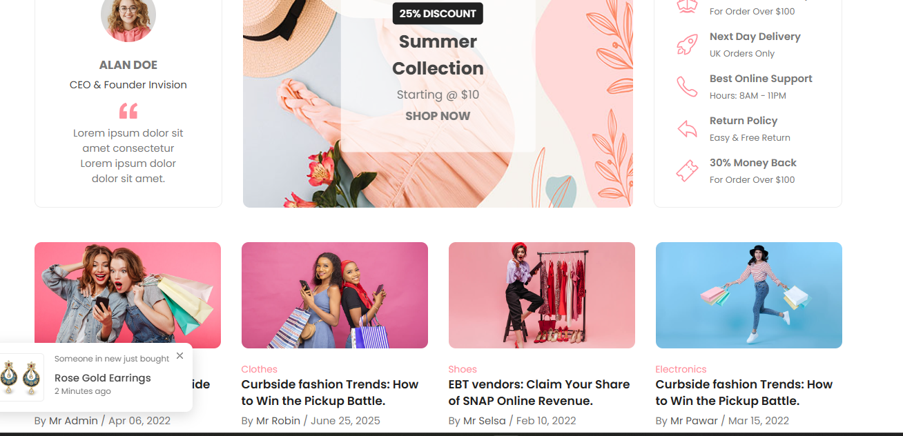
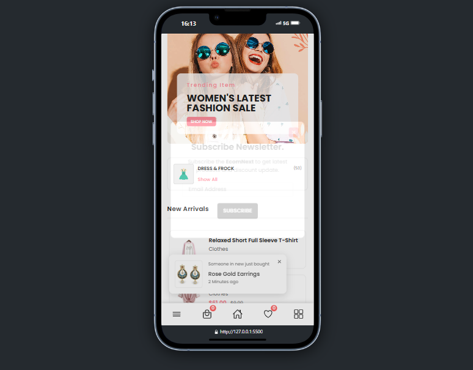
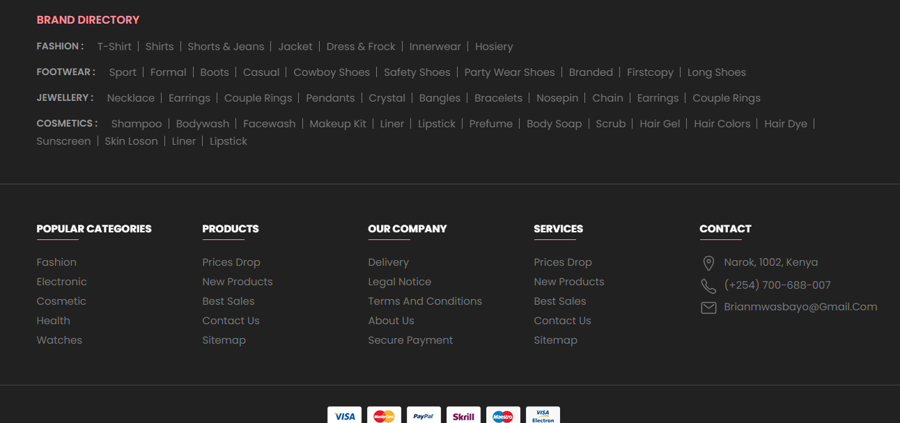

# EcomNext - eCommerce Website

Welcome to **EcomNext**, a modern and responsive eCommerce website designed to provide a seamless shopping experience. This project showcases a clean and attractive UI with multiple product categories, trending items, and special offers.

---

## View live 

The project is deployed on Vercel. You can view the live site here:

[Live Demo - Vercel Link](https://ecom-next-6i4m6njo0-brians-projects-bcfd072c.vercel.app/)

## Features

- Responsive design optimized for desktop and mobile devices.
- Multiple product categories including Clothes, Footwear, Jewelry, Perfume, Cosmetics, and more.
- Featured product sections: Best Sellers, New Arrivals, Trending, Top Rated, and Deal of the Day.
- Interactive elements such as product sliders, category filters, and user actions (wishlist, cart).
- Newsletter subscription modal.
- Testimonials and blog sections.
- Multi-language and currency support.
- Social media integration.

---

## Screenshots

### Homepage Banner



### Product Showcase



### Responsive


### Footer 


---


---

## How to Run Locally

1. Clone the repository:
   ```bash
   git clone <repository-url>
   ```
2. Open the project folder.
3. Open `index.html` in your preferred web browser.
4. Explore the website and its features.

---

## Contact

For any inquiries or feedback, please contact:

- Email: brianmwasbayo@gmail.com
- Phone: (+254) 700-688-007

---

Thank you for visiting **EcomNext**! We hope you enjoy the shopping experience.
